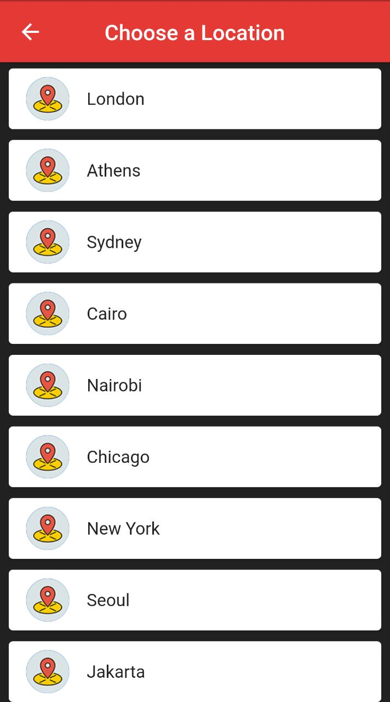
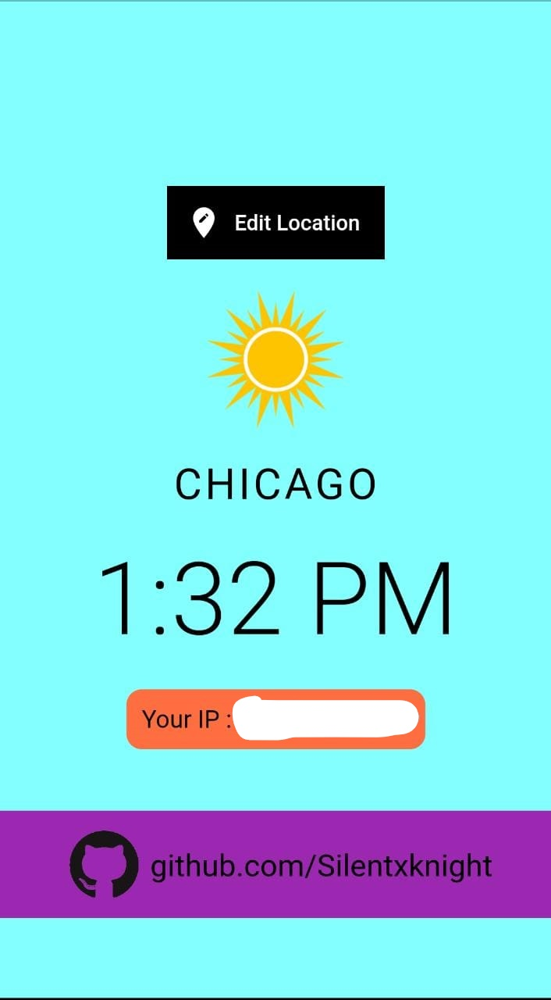
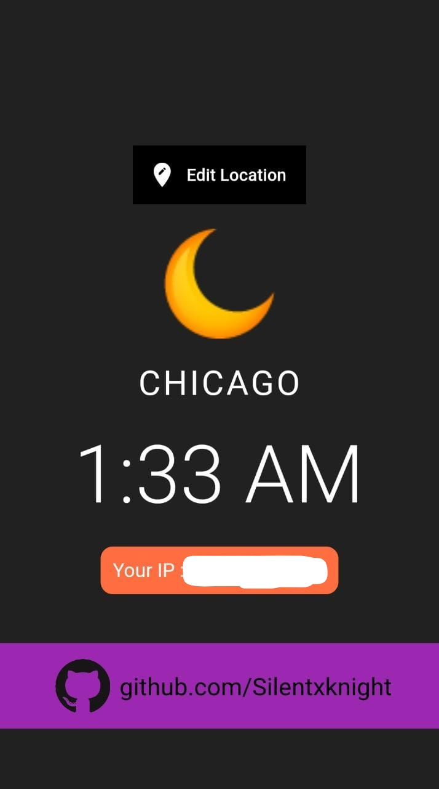

# World Time App

With the help of worldtimeapi.org, it'll show the time of some cities and your IP Address.

## Future Plan 
Moving the enitre backend to a new server which will initially provide the same details (e.g Ip Address, Time etc) more efficiently.
Later more updated will be done!

## Some Screenshots Of The UI

<!--[alt text](http://url/to/img.png)
 -->
